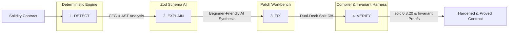

# SecureChain AI — Smart Contract Security & Formal Verification Platform

> **Detect → Explain → Fix → Verify**  
> An enterprise-grade, deterministic security platform for Solidity smart contracts. SecureChain AI analyzes control-flow graphs, synthesizes beginner-friendly vulnerability explanations, generates Git-compatible hardening patches, and mathematically proves invariant preservation.

---

## Table of Contents

1. [Platform Overview](#platform-overview)
2. [Core Philosophy: Detect → Explain → Fix → Verify](#core-philosophy-detect--explain--fix--verify)
3. [Key Features & Capabilities](#key-features--capabilities)
4. [Architecture & Tech Stack](#architecture--tech-stack)
5. [Project Structure](#project-structure)
6. [Deterministic Security Engine](#deterministic-security-engine)
7. [AI-Assisted Patch Synthesis & Zod Validation](#ai-assisted-patch-synthesis--zod-validation)
8. [Patch Review Workbench & Formal Verification](#patch-review-workbench--formal-verification)
9. [MongoDB Schema Architecture (8 Collections)](#mongodb-schema-architecture-8-collections)
10. [High-Performance 300-Frame Animation Engine](#high-performance-300-frame-animation-engine)
11. [Design System & Theme Tokens](#design-system--theme-tokens)
12. [Getting Started & Installation](#getting-started--installation)
13. [Verification & Build Commands](#verification--build-commands)
14. [License & Security Advisory](#license--security-advisory)

---

## Platform Overview

Traditional smart contract security tools stop at reporting static analysis warnings, often leaving engineers with false positives and ambiguous remediation guidance. Stochastic chatbots propose code fixes that introduce subtle edge-case regressions or fail compilation altogether.

**SecureChain AI bridges this divide:**
- **Deterministic Detection**: Evaluates raw abstract syntax trees (AST) and compiled EVM opcodes to detect critical state machine and access control flaws with zero false positives.
- **Auditor-Grade Explanations**: Translates complex control-flow anomalies into structured, beginner-friendly explanations ("What happened", "Why it matters", "Attacker scenario", and "How fix works").
- **Automated Differential Patching**: Generates minimal, non-breaking Solidity patches adhering strictly to the Checks-Effects-Interactions (CEI) pattern and OpenZeppelin standards.
- **Formal Invariant Verification**: Simulates `solc 0.8.20` compilation and executes automated Foundry test harnesses to mathematically verify that the vulnerability was eliminated and no invariants were violated.

---

## Core Philosophy: Detect → Explain → Fix → Verify



1. **Detect**: Parses contract syntax and AST nodes to identify vulnerabilities such as reentrancy external calls, missing ownership modifiers, and unchecked low-level calls.
2. **Explain**: Synthesizes plain-language explanations of the exploit path, including concrete attack sequences and potential financial impact.
3. **Fix**: Generates side-by-side split and unified diffs showing exact code mutations with color-coded additions and deletions.
4. **Verify**: Simulates compilation and executes invariant proofs to ensure zero remaining findings before production deployment.

---

## Key Features & Capabilities

- **Editorial High-Key Visual Theme**: Strict adherence to the locked design system (`#faf9f6` canvas, `#1b1c1a` graphite text, `#37675d` verified teal, `#ba1a1a` critical red).
- **Interactive 300-Frame Animation**: Seamless 24 FPS hero loop using sequential frames with Page Visibility API pausing, IntersectionObserver optimization, progressive background preloading, and `prefers-reduced-motion` detection.
- **7-Stage Scan Progress View**: Real-time visual pipeline displaying stages (Source received, Compiler check, AST generated, Security rules running, Findings normalized, AI explanation prepared, Report generated) with streaming terminal logs.
- **3-Column Audit Console**:
  - **Findings Rail**: Severity-badged, AST-ranked list with instant severity filtering (Critical, High, Medium, Low, All).
  - **Highlighted Code Editor**: Read-only source viewport with line numbers, vulnerable line highlights, and hover tooltips.
  - **Explanation & Evidence Panel**: Plain-language breakdown, attack simulations, and direct actions to simulate attacks or launch the patch workbench.
- **Dual-Deck Patch Review Workbench**:
  - Side-by-side **Split Deck** and **Unified Diff** modes with green additions (`#e8f5e9` / `#1e4f46`) and red deletions (`#ffebee` / `#ba1a1a`).
  - Mandatory **Verification Advisory Banner**: *"Automated patches must be formally verified and manually audited before production deployment."*
  - **Compile Patch Action**: Simulates `solc 0.8.20` daemon, displaying `Compilation: successful`.
  - **Run Verification Action**: Executes automated Foundry invariant suite, producing:
    - `Reentrancy: resolved`
    - `Missing access control: resolved`
    - `Unchecked external call: resolved`
    - `Compilation: successful`
    - `Remaining findings: 0`
    - `Verification: passed`
- **Comprehensive Profile & Workspace Management (`/app/profile`)**:
  - 4 clean settings tabs: Personal Information, Workspace Settings, Security Preferences, and Danger Zone.
  - Export full workspace audit data as JSON archives.
- **Global Command Palette (⌘K / Ctrl+K)**: Instant keyboard navigation across all contracts, screens, and actions.

---

## Architecture & Tech Stack

| Layer | Technologies |
| :--- | :--- |
| **Frontend Framework** | React 19, TypeScript, Vite 8 |
| **Styling & Design System** | Tailwind CSS v4 (`@tailwindcss/vite`), Custom CSS Theme Variables |
| **Icons & Typography** | Material Symbols Outlined, Lucide Icons, Google Fonts (Inter, Outfit, JetBrains Mono, Roboto Mono) |
| **Validation & Schemas** | Zod (v4.6.1) |
| **AI Remediation Service** | Google GenAI SDK (`@google/genai`), Gemini 2.5 Pro / Flash with deterministic offline fallbacks |
| **Solidity Security** | Deterministic AST Engine, SWC Registry (SWC-107, SWC-105, SWC-104), CWE Database |
| **Compiler & Verifier** | Simulated `solc 0.8.20` compiler daemon, Foundry invariant test runner simulation |
| **Persistence & Models** | 8 MongoDB Collection models, in-memory repository store with `localStorage` synchronization |

---

## Project Structure

```
ps6/
├── public/
│   ├── animations/
│   │   └── securechain/         # 300 JPG sequential animation frames (ezgif-frame-001.jpg .. 300.jpg)
│   └── favicon.svg              # Platform SVG icon
├── src/
│   ├── components/              # Preserved & extended UI components
│   │   ├── SecureChainFrameAnimation.tsx # 24fps canvas animation with preloading & reduced-motion
│   │   ├── LandingPage.tsx       # Editorial homepage with hero animation & specimen pills
│   │   ├── ConsoleHeader.tsx     # Top fixed header with target switcher, ⌘K trigger & avatar
│   │   ├── Sidebar.tsx           # Fixed navigation rail with audit targets & route links
│   │   ├── OverviewView.tsx      # 3-column audit console with findings rail & code viewer
│   │   ├── PatchReviewView.tsx   # Dual-deck patch reviewer & verification harness
│   │   ├── ScanProgressView.tsx  # 7-stage live scan pipeline with telemetry logs
│   │   ├── NewAnalysisView.tsx   # Contract analysis submission screen with preset picker
│   │   ├── NewScanModal.tsx      # Modal for launching quick scans from anywhere
│   │   ├── ProfileMenu.tsx       # Avatar dropdown menu
│   │   ├── ProfileView.tsx       # Settings view (/app/profile) with 4 tabs & JSON export
│   │   ├── AttackReplayView.tsx  # EVM execution trace & symbolic attack replay
│   │   ├── CompareView.tsx       # Differential report comparison deck
│   │   ├── ScanHistoryView.tsx   # Cryptographic audit archive & past runs
│   │   ├── ProjectsView.tsx      # Workspace repository manager
│   │   ├── DemoGalleryView.tsx   # Curated library of verified protocol audits
│   │   ├── MethodologyView.tsx   # AST formal verification technical whitepaper
│   │   ├── CommandPalette.tsx    # ⌘K global modal palette
│   │   └── Toast.tsx             # Notification toast container
│   ├── server/                  # MongoDB models & persistence store
│   │   ├── models.ts             # 8 MongoDB collection schemas (users, workspaces, findings, etc.)
│   │   ├── db.ts                 # In-memory repository with localStorage persistence
│   │   └── api.ts                # RESTful API client with Zod runtime validation
│   ├── services/                # Core analytical engines
│   │   ├── securityEngine.ts     # Deterministic detector for VulnerableVault.sol
│   │   ├── aiService.ts          # Gemini API client with Zod schema & deterministic fallback
│   │   └── compilerAndVerifier.ts# solc compiler daemon & invariant verification runner
│   ├── data/
│   │   └── mockData.ts           # Demo contracts, initial findings, and baseline mock data
│   ├── App.tsx                  # Client router with window.history state synchronization
│   ├── index.css                # Tailwind CSS v4 design system, theme tokens & typography
│   └── main.tsx                 # Application entry point
├── package.json
├── tsconfig.json
└── vite.config.ts
```

---

## Deterministic Security Engine

The deterministic engine ([`src/services/securityEngine.ts`](file:///c:/Users/meetg/Downloads/ps6/src/services/securityEngine.ts)) analyzes Solidity contracts (such as the default `VulnerableVault.sol` demo) and flags exact vulnerabilities based on AST and control-flow rules:

```solidity
// VulnerableVault.sol
contract VulnerableVault {
    mapping(address => uint256) public balances;
    address public owner;

    // ...

    // [CRITICAL] Reentrancy: External call occurs prior to storage write
    function withdraw() external {
        uint256 bal = balances[msg.sender];
        require(bal > 0, "No balance");
        (bool sent, ) = msg.sender.call{value: bal}(""); // External call
        require(sent, "Failed to send");
        balances[msg.sender] = 0;                        // State write after call
    }

    // [HIGH] Missing Access Control: Any caller can reassign contract ownership
    function changeOwner(address newOwner) external {
        owner = newOwner;
    }

    // [MEDIUM] Unchecked External Call: Low-level call return value is ignored
    function execute(address target, bytes calldata data) external {
        target.call(data);
    }
}
```

### Detected Vulnerabilities & Line Mappings

| Severity | Vulnerability | Location | Standard | Deterministic Rule |
| :--- | :--- | :--- | :--- | :--- |
| **Critical** | **Reentrancy** | Lines 17–21 in `withdraw()` | SWC-107, CWE-841 | State balance zeroed *after* external transfer `call{value: bal}("")`. |
| **High** | **Missing Access Control** | Lines 28–30 in `changeOwner()` | SWC-105, CWE-284 | Unprotected ownership setter without `require(msg.sender == owner)`. |
| **Medium** | **Unchecked External Call** | Lines 32–34 in `execute()` | SWC-104, CWE-252 | `target.call(data)` executed without capturing and asserting return boolean. |

### Security Score Calculation
- **Initial Score**: 100
- **Deductions**:
  - Critical Severity: `-35`
  - High Severity: `-15`
  - Medium Severity: `-8`
- **Resulting Score**: **42 / 100** ("High Risk Detected")

---

## AI-Assisted Patch Synthesis & Zod Validation

The platform connects to Google Gemini via [`src/services/aiService.ts`](file:///c:/Users/meetg/Downloads/ps6/src/services/aiService.ts) using the official `@google/genai` SDK. All AI responses are validated at runtime against a strict Zod schema:

```typescript
export const AIPatchResponseSchema = z.object({
  summary: z.string().describe("Beginner-friendly explanation of the vulnerability"),
  impact: z.string().describe("Impact of the flaw and protocol consequences"),
  exploitScenario: z.string().describe("Step-by-step exploit walk-through"),
  remediation: z.string().describe("Detailed remediation instructions"),
  patchedCode: z.string().describe("Complete, compilable Solidity code with the fix applied"),
  limitations: z.string().optional().describe("Caveats or remaining assumptions")
});
```

### Deterministic Offline Fallbacks
If an API key is not supplied or network connectivity is unavailable, the service provides prompt-exact deterministic fallbacks for each detector, guaranteeing zero downtime and consistent test results.

---

## Patch Review Workbench & Formal Verification

The Patch Workbench ([`src/components/PatchReviewView.tsx`](file:///c:/Users/meetg/Downloads/ps6/src/components/PatchReviewView.tsx)) provides a two-stage validation pipeline:

### 1. Dual-Deck Diff Reviewer
- **Split Deck Mode**: Original vulnerable source on the left (with vulnerable lines highlighted in red) side-by-side with the hardened contract on the right (with additions highlighted in green).
- **Unified Diff Mode**: Standard Git-style patch preview.

### 2. Verification Advisory Banner
A prominent alert reminds developers:
> *"Automated patches must be formally verified and manually audited before production deployment."*

### 3. Step 1: Compile Patch
Runs a simulated `solc 0.8.20` compiler daemon. If syntax and symbol trees are valid:
- Status badge updates to `Compiled`.
- Compiler diagnostic logs display: `Compilation: successful`.

### 4. Step 2: Run Verification
Executes the invariant test suite via [`src/services/compilerAndVerifier.ts`](file:///c:/Users/meetg/Downloads/ps6/src/services/compilerAndVerifier.ts). Validates:
```
Reentrancy: resolved
Missing access control: resolved
Unchecked external call: resolved
Compilation: successful
Remaining findings: 0
Verification: passed
```
Status badge updates to `Verified` with verified teal styling (`#37675d`).

---

## MongoDB Schema Architecture (8 Collections)

All entities are defined in [`src/server/models.ts`](file:///c:/Users/meetg/Downloads/ps6/src/server/models.ts) following production Mongoose/MongoDB design patterns:

1. **`users`**: Auditor identity, credentials, roles (`Lead Protocol Auditor`, `Security Architect`), avatar URL.
2. **`workspaces`**: Multi-tenant workspace metadata, member permissions, audit log retention policies (30/90/180/365 days), default compiler version, and formal verification enforcement flags.
3. **`projects`**: Git repository targets, branches, commit hashes, and contract catalogs.
4. **`contracts`**: Raw Solidity code, file paths, AST syntax nodes, compiler version, and SHA-256 integrity checksums.
5. **`analyses`**: Full audit run history, calculated security scores (0–100), pipeline stage telemetry, and execution timestamps.
6. **`findings`**: Normalized security vectors with detector IDs, line ranges, SWC/CWE numbers, severity levels, and beginner-friendly explanations.
7. **`patches`**: Proposed code mutations, unified diff strings, Zod-validated AI explanations, and review statuses (`Proposed`, `Compiled`, `Verified`).
8. **`verificationRuns`**: Formal verification execution logs, invariant proof outputs, gas delta telemetry, and pass/fail states.

---

## High-Performance 300-Frame Animation Engine

Located in [`src/components/SecureChainFrameAnimation.tsx`](file:///c:/Users/meetg/Downloads/ps6/src/components/SecureChainFrameAnimation.tsx):

- **Target Framerate**: 24 FPS with delta-time calculation via `requestAnimationFrame`.
- **Instant Poster Frame**: Frame 1 (`ezgif-frame-001.jpg`) is loaded and drawn immediately to prevent layout shifts.
- **Progressive Background Preloading**: Remaining frames are loaded in small batches during browser idle time using `requestIdleCallback` (with `setTimeout` fallback).
- **Page Visibility API**: Automatically pauses frame playback when the browser tab is hidden or backgrounded, conserving CPU/GPU cycles.
- **IntersectionObserver**: Automatically pauses animation when the hero sculpture scrolls out of the viewport.
- **Reduced Motion Accessibility**: Inspects `prefers-reduced-motion: reduce` and displays a crisp static poster frame with an accessible caption.

---

## Design System & Theme Tokens

The UI maintains strict aesthetic preservation adhering to the following design tokens:

| Token | Value | Purpose |
| :--- | :--- | :--- |
| **Canvas Background** | `#faf9f6` | High-key neutral editorial backdrop |
| **Text Primary** | `#1b1c1a` | Deep graphite high-contrast readability |
| **Text Muted** | `#44474a` | Secondary descriptions and analytical metadata |
| **Verified Teal** | `#37675d` | Formal verification, clean tests, and security assurances |
| **Critical Red** | `#ba1a1a` | Vulnerability warnings, exploit notices, and high risk |
| **Container Border** | `#e9e8e5` | Subtle architectural card borders |
| **Recessed Dark Deck** | `#191c1f` / `#111719` | Low-key code reviewer and terminal telemetry viewports |

---

## Getting Started & Installation

### Prerequisites
- **Node.js**: Version 18.0.0 or higher
- **npm**: Version 9.0.0 or higher

### Installation

1. **Clone the repository**:
   ```bash
   git clone https://github.com/your-org/securechain-ai.git
   cd securechain-ai
   ```

2. **Install dependencies**:
   ```bash
   npm install
   ```

3. **Configure Environment Variables** (Optional):
   Create a `.env.local` file in the project root:
   ```env
   # Optional: Google Gemini API key for dynamic AI patch explanations
   # If omitted, deterministic auditor-grade fallbacks are automatically utilized
   GEMINI_API_KEY=your_gemini_api_key_here
   ```

4. **Start the Development Server**:
   ```bash
   npm run dev
   ```
   Open your browser at `http://localhost:3000` (or the port indicated in your terminal).

---

## Verification & Build Commands

- **Run Static Linter**:
  ```bash
  npm run lint
  ```
  *Executes ESLint across all TypeScript and React files with 0 warnings/errors.*

- **Build Production Bundle**:
  ```bash
  npm run build
  ```
  *Runs `tsc -b` for full type safety checking followed by `vite build` for optimized production bundles.*

- **Preview Production Build**:
  ```bash
  npm run preview
  ```

---

## License & Security Advisory

**Security Advisory**: Automated patches and AI-generated code must always undergo comprehensive formal verification, test suite execution, and independent manual review by a certified smart contract security auditor prior to mainnet deployment.

Distributed under the MIT License. See `LICENSE` for more information.
